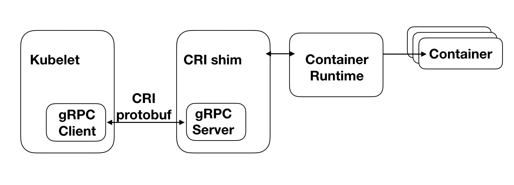

####CRI(容器运行时)
Kubernetes node（kubelet）主要功能就是启动和停止容器的组件，称之为容器运行时(Container Runtime），kubernetes 1.5版本加入容器运行时插件API 即 CRI(Container Runtime Interface）。通过插件接口模式， Kubernetes 无需重新编译就可以使用更多的容器运行时。
Kubernetes CRI支持的容器运行时包括docker、rkt、cri-o、frankti、kata-containers和clear-containers等。
CRI 包括 Protocol Buffers、gRPC API、运行库工具
kubelet 使用gRPC框架通过 UNIX Socket 与 容器运行时通讯，kubelet作为客户端，而CRI shim作为服务器。

- protocol buffers API提供两个gRPC服务，ImageService和RuntimeService。
 - ImageService提供拉取、查看、和移除镜像的RPC。
 - RuntimeSerivce则提供管理Pods和容器生命周期管理的RPC，以及与容器进行交互(exec/attach/port-forward)。容器运行时能够同时管理镜像和容器（例如：Docker和Rkt），并且可以通过同一个套接字提供这两种服务。在Kubelet中，这个套接字通过–container-runtime-endpoint和–image-service-endpoint设置Socket。

####pod的生命周期和管理
Pod由一组应用容器组成，其中包括共有的环境和资源约束。在CRI里，这个环境被称为PodSanbox.
在启动Pod之前，kubelet调用RuntimeService.RunPodSanbox来创建环境。这一过程包括为Pod设置网络资源分配IP等操作。PodSanbox被激活后，就可以独立地创建、启动、停止、和删除不同的容器。kubelet 会在停止和删除PodSanbox之前首先停止和删除其中的容器。
**kubelet 的职责在于通过RPC管理容器的生命周期，实现容器生命周期的钩子，存活和健康监测，以及执行 Pod 的重启策略等。**

Kubernetes提供了与pod及其中的容器进行交互的功能 (kubectl exec/attach/port-forward)。kubelet目前提供了两种方式来支持这些功能
- 调用容器的本地方法
- 使用 Node 上的工具(nsenter、socat)

使用Docker-CRI来创建容器
```
ubectl create deployment nginx --image=nginx

deployment.apps/nginx created
```

各 CRI 运行时安装手册参考 (https://kubernetes.io/docs/setup/production-environment/container-runtimes/)