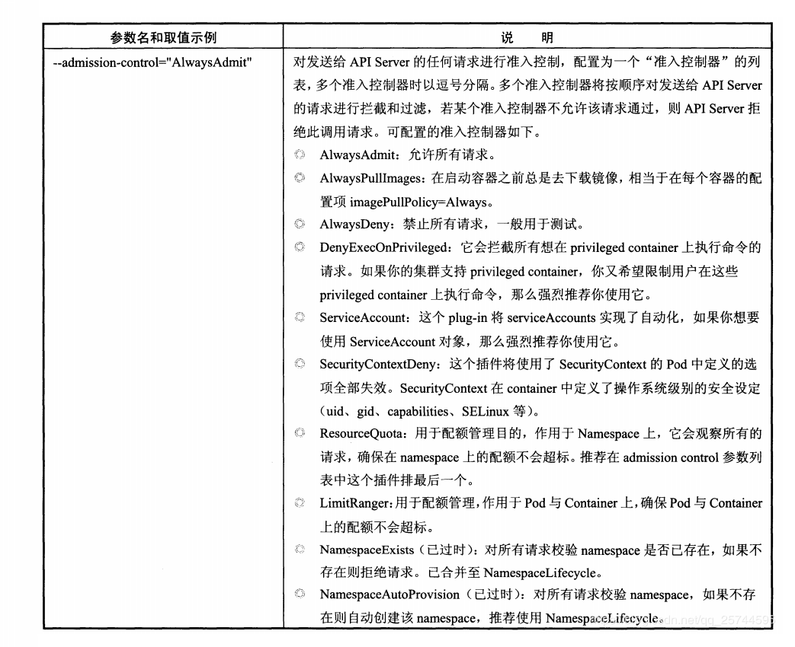
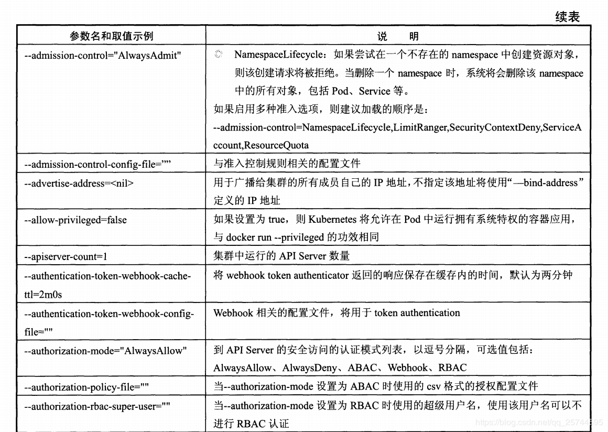
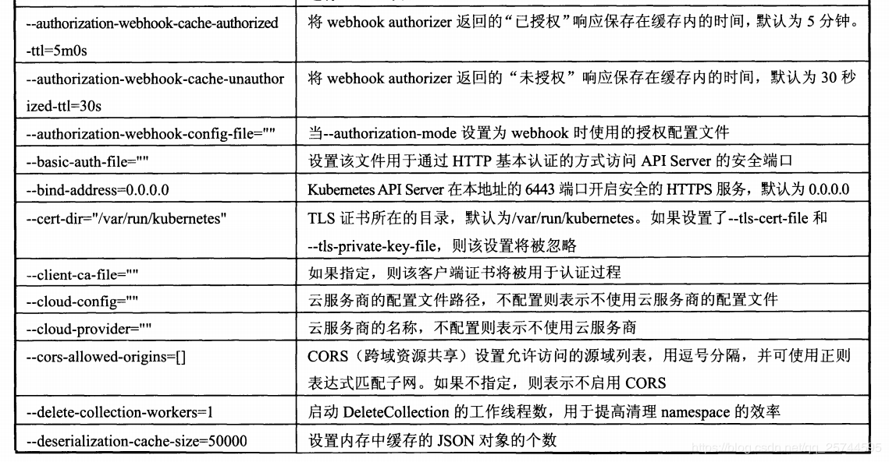
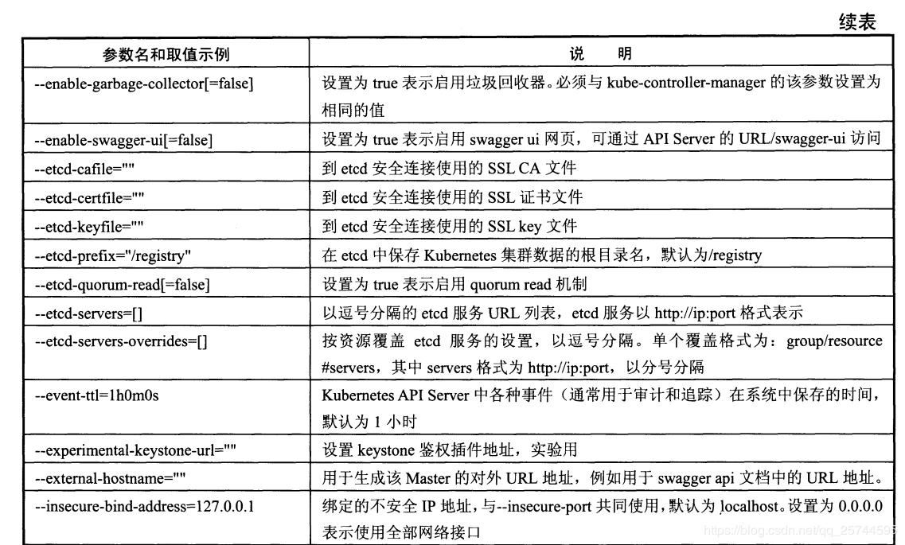
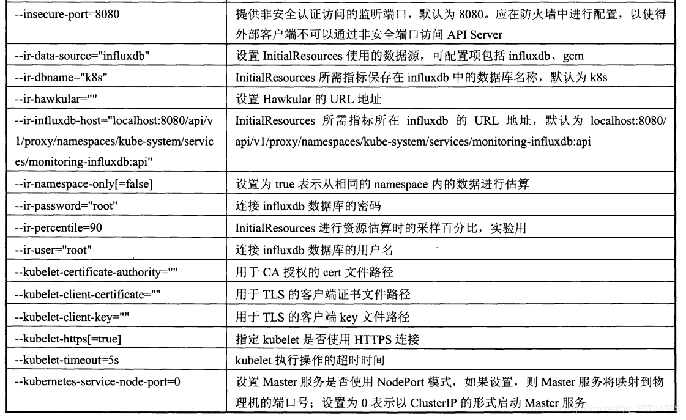
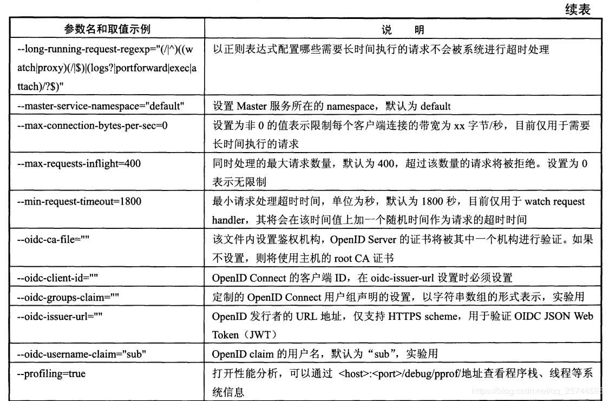
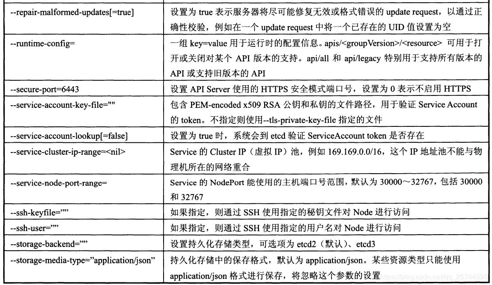
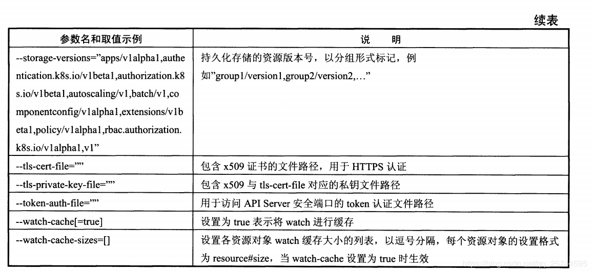

1. 公共参数配置，可用于 kube-apiserver、kube-controller-manager、kube-scheduler、kubelet、kube-proxy。

2. kube-apiserver启动参数详细说明

3. kube-controller-manager 启动参数

4. kube-scheduler 启动参数

5. kubelet 启动参数

6. kube-proxy 启动参数

7. kubectl 子命令

